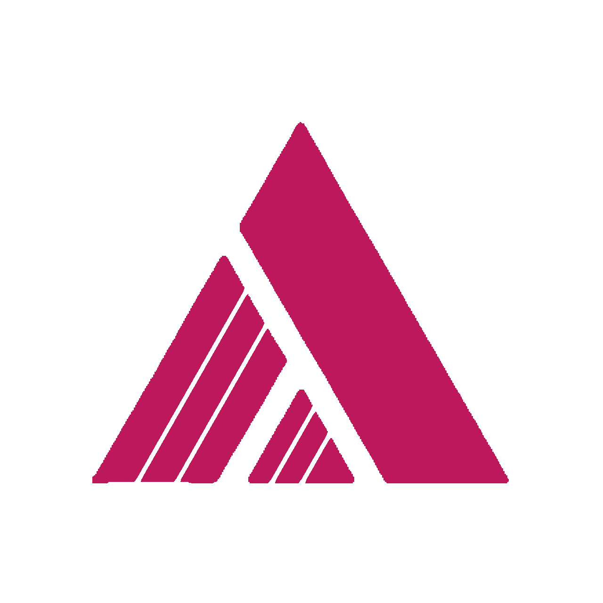

<p align="center">
  
</p>

<h1 align="center">ALATHEREONN Portfolio</h1>

<p align="center">
  A dark futuristic portfolio website for Zakaria Fattawari, built to showcase profile, projects, qualifications, certificates, contact channels, and a little bit of personality.
</p>

<p align="center">
  <a href="https://alathereon.com">Live Website</a>
  |
  <a href="https://github.com/alathereonn/production-porto">Repository</a>
</p>

<p align="center">
  
  
  
  
</p>

## Overview

This repository contains my personal portfolio website, designed around a dark galaxy-inspired visual system with magenta accents, animated interactions, responsive sections, and data-driven content.

The site is not just a static profile page. It works as a compact digital space for:

- Introducing who I am and what I am interested in.
- Presenting selected projects with images, tech stacks, source links, and demos.
- Showing certifications, teaching experiences, and education history.
- Providing contact links, social networks, and a working contact form.
- Adding personal details through music, quotes, motion, and visual polish.

## Features

- Responsive navbar with desktop links and mobile hamburger navigation.
- Galaxy background with animated particle canvas.
- Hero section with dynamic typewriter text and CV link.
- About section with image gallery, education and skill icon cards, music player, and rotating quote typing effect.
- Qualification section with certification links, timeline cards, and GitHub call to action.
- Featured Projects showcase with swipe support, animated project switching, project media overlays, and tech stack badges.
- Contact section with form, social network buttons, contact protocol cards, playlist carousel, and custom success modal.
- Custom favicon, global scrollbar theme, scroll progress bar, and custom 404 route.

## Tech Stack

| Area | Tools |
| --- | --- |
| Framework | Vue 3 |
| Build Tool | Vite |
| Styling | Tailwind CSS 4, custom CSS |
| Routing | Vue Router |
| Linting | ESLint, Oxlint |
| Deployment | Vercel |

## Project Structure

```text
web-porto/
|-- public/
|   |-- certificates/
|   |-- cv/
|   |-- favicon.svg
|   `-- alathereonn-logo-transparent.png
|-- src/
|   |-- assets/
|   |   `-- style.css
|   |-- components/
|   |   |-- About.vue
|   |   |-- Contact.vue
|   |   |-- Hero.vue
|   |   |-- Navbar.vue
|   |   |-- Project.vue
|   |   |-- Qualification.vue
|   |   `-- ScrollReveal.vue
|   |-- data/
|   |   |-- about.json
|   |   |-- hero.json
|   |   |-- project.json
|   |   `-- qualification.json
|   |-- images/
|   |-- router/
|   |-- App.vue
|   `-- main.js
|-- index.html
|-- package.json
|-- vercel.json
`-- vite.config.js
```

## Getting Started

Install dependencies:

```sh
npm install
```

Run the development server:

```sh
npm run dev
```

Build for production:

```sh
npm run build
```

Preview the production build:

```sh
npm run preview
```

Run linting:

```sh
npm run lint
```

## Content Editing

Most visible content is stored in JSON files so the site can be updated without digging through component markup.

- `src/data/hero.json` controls hero names, interests, CV link, and intro copy.
- `src/data/about.json` controls about paragraphs, skills, education summary, songs, and quotes.
- `src/data/project.json` controls project cards, descriptions, images, tech stacks, repo links, and demo links.
- `src/data/qualification.json` controls certifications, teaching experiences, education entries, and certificate links.

Images used by sections are stored in `src/images/`, while directly accessible public assets such as favicons, CV files, and certificate files live in `public/`.

## Design Notes

The visual direction is dark, compact, and futuristic:

- Deep black card surfaces.
- Primary magenta accents.
- Soft border glow.
- Smooth motion that supports the content instead of overpowering it.
- Mobile-first adjustments for touch navigation, readable text, and compact layouts.

## Deployment

The project is configured for Vercel. A normal production deployment can be generated with:

```sh
npm run build
```

Vercel serves the generated `dist/` output and uses `vercel.json` for route fallback behavior.

## Author

Built and maintained by **Zakaria Fattawari**, also known as **Alathereonn**.

- GitHub: [@alathereonn](https://github.com/alathereonn)
- Portfolio: [alathereon.com](https://alathereon.com)
